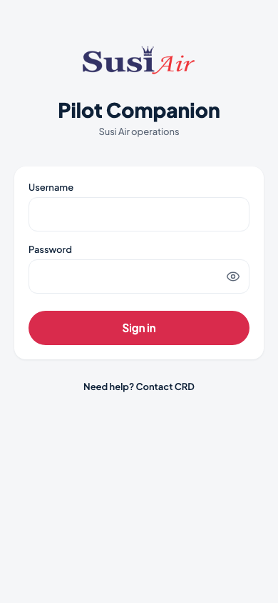
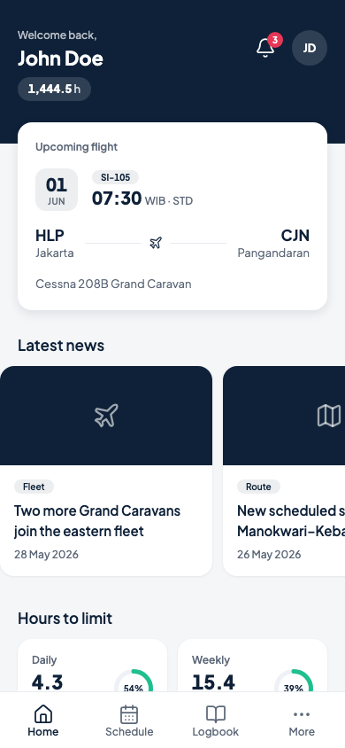
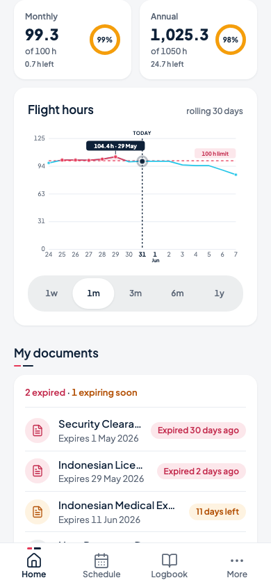
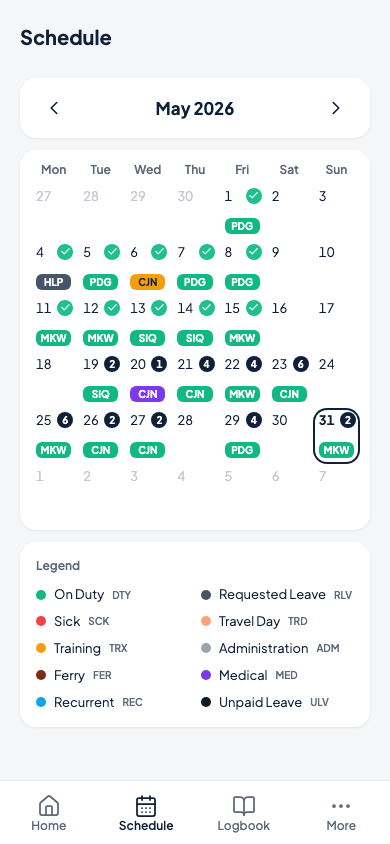
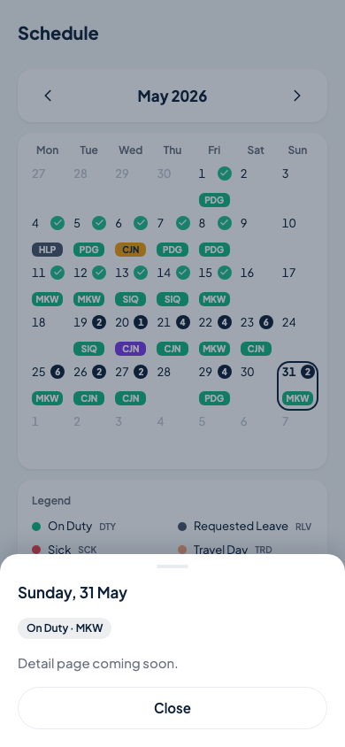

# Susi Air Pilot Companion

[](https://github.com/didapatria/susiair-pilot-companion/actions/workflows/ci.yml)

A mobile-first pilot logbook & schedule companion, built as the Susi Air frontend technical test.

**Live demo:** https://susiair-pilot-companion.vercel.app — sign in with any non-empty username/password (no real authentication, per the brief).

Three screens: **Sign In**, **Home** (dashboard with the Hours-to-Limit section), and **Schedule** (duty calendar). Logbook and More are intentional placeholders reachable from the bottom navigation.

| Sign in | Home | Hours (1w) | Hours (1m, over limit) |
|---|---|---|---|
|  |  |  |  |

| Documents | Schedule (May 2026) | Day detail sheet |
|---|---|---|
|  |  |  |

## Quickstart

Requires Node ≥ 20 and pnpm.

```bash
pnpm install            # installs deps and runs nuxt prepare
pnpm dev                # dev server at http://localhost:3000
pnpm build              # production build
pnpm preview            # preview the production build
pnpm typecheck          # vue-tsc via nuxt typecheck (strict)
pnpm lint               # eslint
pnpm test               # vitest unit tests (rolling-sum fixtures & utilities)

pnpm exec playwright install chromium   # once, before e2e
pnpm test:e2e           # Playwright smoke suite (mobile project, 390×844)
```

## Tech stack & library choices

- **Nuxt 4 (SSR on), Composition API + `<script setup>`, TypeScript strict.** SSR stays on because the app's "today" is a fixed constant (see Data notes), which keeps server and client renders byte-identical — no hydration tricks needed.
- **SCSS with a token architecture** — `app/assets/scss/abstracts/` holds `$colors / $spacing / $type-scale / $radii / $shadows / $motion` maps that are emitted once as CSS custom properties; components consume `var(--…)` only, so no raw hex values live outside the token file. Note: the brief's mandatory stack lists **SCSS** while the invitation email mentioned Tailwind — I followed the formal brief and I'm happy to adapt if Tailwind is preferred.
- **Pinia, three file-aligned stores** (`flightHours`, `documents`, `schedule`) — one store per mock JSON file, each exposing `{ data, status, load() }` plus typed getters. Store boundaries follow data ownership; components never import JSON directly.
- **Hand-rolled SVG line chart** instead of a chart library. The spec is small and fixed (15 points, one series, one limit line, five toggles), and drawing it directly gives full control over the red limit line, the today marker, and the over-limit emphasis (the exceeded segment is re-drawn in red through a `clipPath` above the limit line, plus a soft red band) — at zero added bundle cost.
- **lucide-vue-next** for line icons (1.75 px stroke, per the design direction).
- **Vitest** for the engine/utility unit tests, **Playwright** (a "mobile" project at 390×844) for the e2e smoke pass that also captures the screenshots above.

## Data notes

- The app's canonical "today" is **31 May 2026** (`APP_TODAY` in `app/utils/constants.ts`), as instructed by the brief, so the chart always has data behind and ahead. All date math runs through pure UTC epoch-day helpers — no `new Date()` in render paths, which also keeps SSR deterministic.
- The schedules dataset carries its own internal date, so duty **statuses render verbatim** from the JSON and are never recomputed against today.
- The calendar is **data-driven end-to-end**: the legend renders from the JSON `legend[]`, and each day cell is filled with the record's own `base_color` (authoritative per the dataset's `fieldGuide`), with black/white text chosen by a small auto-contrast function.
- Chart limits and Y-bounds are read from the JSON `chartBounds` object at runtime rather than hardcoded (the JSON's `1y.max` is 1200).
- There is no backend and no API calls: the three JSON files are statically imported. Store `load()` actions add a simulated **~400 ms latency** so the skeleton loading states are real and visible on first paint.

## Rolling-sum engine

Every chart point and limit card is a rolling sum, not a single day's hours:

```
Y(D) = sum of flight hours from (D − windowDays + 1) up to and including D
```

- The window is **inclusive** of `D`; dates missing from the dataset (before 27 Dec 2024 or after 31 May 2026) contribute **0**.
- Implementation: one prefix-sum array over the contiguous daily series, built in **integer tenths** (the dataset is 1-decimal throughout, so this is lossless and 365-day sums accumulate zero floating-point drift). Each query is O(1) with clamping at both dataset edges.
- The engine is a pure module (`app/utils/rollingHours.ts`) with no framework imports, unit-tested against precomputed fixtures: all four card values, the complete 15-point 1w and 1m series, the exact dates where the 1m series exceeds its 100 h limit, spot values for 3m/6m/1y, and the dataset integrity check (the entries sum to `pilot.totalFlightHours`, 1,444.5).

## Project structure

```
app/
├── assets/
│   ├── data/          the three mock JSON files (statically imported)
│   └── scss/          abstracts/ (tokens, mixins) · base/ (reset, base) · main.scss
├── components/
│   ├── ui/            AppCard · AppButton · AppTextField · StatusPill · ProgressRing
│   │                  RangeToggle · SkeletonBlock · EmptyState · BottomSheet
│   ├── layout/        BottomNav
│   ├── home/          AppHeader · UpcomingFlightCard · NewsCarousel · NewsCard
│   │                  HoursToLimitSection · LimitCard · DocumentsList · DocumentItem
│   ├── charts/        TrendChart (hand-rolled SVG)
│   └── schedule/      CalendarMonth · CalendarGrid · CalendarDayCell · CalendarLegend
├── composables/       useRollingHours
├── layouts/           default (bottom nav) · auth
├── pages/             index (sign in) · home · schedule · logbook · more
├── stores/            flightHours · documents · schedule
├── types/             data.ts (interfaces mirroring the JSON files)
└── utils/             constants · date · format · status · rollingHours · delay
tests/
├── unit/              rollingHours (fixtures) · date · status · schedule · format
└── e2e/               smoke.spec.ts (sign-in → home → chart toggles → schedule)
```

## What I'd do differently with more time

- Real authentication with route middleware and token refresh.
- i18n (id/en).
- A full Logbook screen with a virtualized entry list.
- MSW contract mocks so a real API can be swapped in without touching stores.
- Visual regression tests on the chart (the over-limit rendering is screenshot-worthy).
- Chart pan/zoom and pinch gestures for longer ranges.
- Offline-first PWA with background sync (the current PWA ships manifest + icons).
- E2E coverage beyond the smoke pass (error states, reduced-motion, keyboard-only flows).
